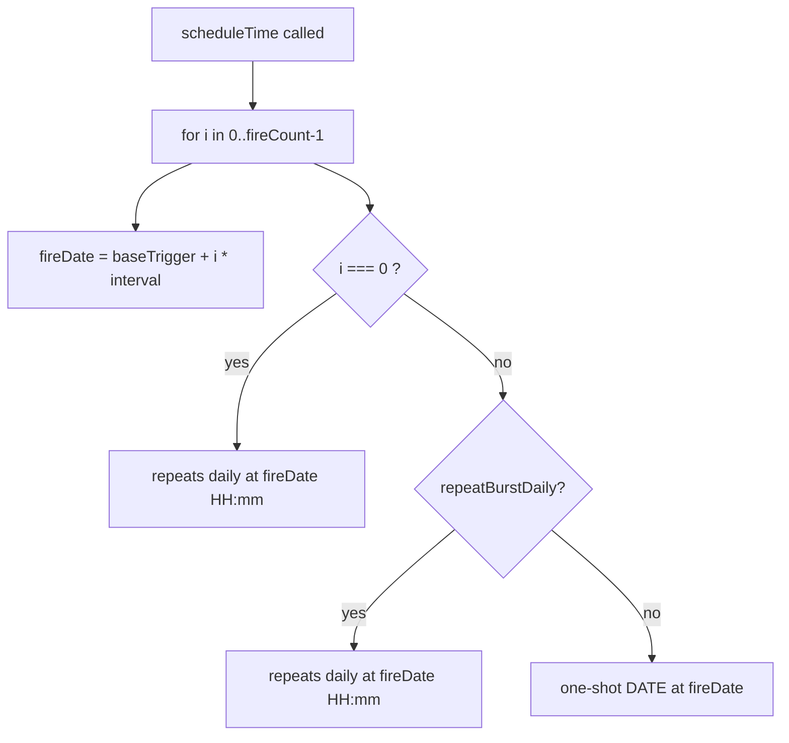

# Reminders Feature — Full Execution Plan (v3.2)

## Progress snapshot

| Phase | Status | Files |
|-------|--------|-------|
| R1 Schema | **Done** | [`schema.ts`](client/src/db/schema.ts) |
| R2 Types + Scheduler | **Done** | [`types.ts`](client/src/domain/reminders/types.ts), [`reminderScheduler.ts`](client/src/services/reminderScheduler.ts) |
| R3 Repo | Pending | `reminderRepo.ts` |
| R4 Parser | Pending | `reminderParser.ts`, `reminderFrequency.ts` |
| R5 Editor | Pending | `ReminderDraftEditor`, [`edit.tsx`](client/src/app/reminders/edit.tsx) |
| R6 UI + Context | Pending | `reminderContext`, `reminder-ui/*`, tab |

---

## Folder naming — logic vs UI vs OS

| Folder | Role | What lives here |
|--------|------|-----------------|
| [`client/src/domain/reminders/`](client/src/domain/reminders/) | Pure logic | `types.ts` ✓, `reminderParser.ts`, `reminderFrequency.ts` |
| [`client/src/services/`](client/src/services/) | OS integrations | `reminderScheduler.ts` ✓ |
| [`client/src/components/reminder-ui/`](client/src/components/reminder-ui/) | React UI | SearchBar, InputBar, ListItem, DraftEditor, SnoozePicker |
| [`client/src/db/`](client/src/db/) | SQLite | `schema.ts` ✓, `reminderRepo.ts` |
| [`client/src/context/`](client/src/context/) | React state | `reminderContext.tsx` |
| [`client/src/app/reminders/`](client/src/app/reminders/) | Routes | `edit.tsx` (editor screen) |

---

## Burst daily feature (`repeat_burst_daily`)

When `fire_count > 1` and `repeat === 'daily'`, each burst can either repeat every day or fire once.

| `repeat_burst_daily` | Meaning | Example |
|----------------------|---------|---------|
| `1` (true, **default**) | Every burst slot repeats daily at its offset time | 9:00 + 9:01 + 9:02 all repeat every day |
| `0` (false) | Only the **first** slot repeats daily; follow-ups are one-shot | 9:00 daily, then 9:01 and 9:02 fire once after that cycle |



**Scheduler rule** (implemented in [`reminderScheduler.ts`](client/src/services/reminderScheduler.ts)):

```typescript
const burstRepeatsDaily = isDaily && row.repeatBurstDaily;

for (let i = 0; i < row.fireCount; i++) {
  const thisFireRepeatsDaily = i === 0 ? isDaily : burstRepeatsDaily;
  // thisFireRepeatsDaily → { hour, minute, repeats: true }
  // else → { date: fireDate }
}
```

**`nextTriggerDate(time, date)`** — if daily and today's time already passed, pushes base to tomorrow before computing burst offsets.

---

## Phase R1 — SQLite Schema (DONE)

Implemented in [`schema.ts`](client/src/db/schema.ts):

```sql
PRAGMA foreign_keys = ON;

CREATE TABLE IF NOT EXISTS reminders (
  id TEXT PRIMARY KEY,
  label TEXT NOT NULL,
  enabled INTEGER NOT NULL DEFAULT 1   -- no trailing comma
);

CREATE TABLE IF NOT EXISTS reminder_times (
  id TEXT PRIMARY KEY,
  reminder_id TEXT NOT NULL REFERENCES reminders(id) ON DELETE CASCADE,
  time TEXT NOT NULL,
  repeat TEXT NOT NULL CHECK (repeat IN ('daily', 'once')),
  date TEXT,
  fire_count INTEGER NOT NULL DEFAULT 1,
  fire_interval_seconds INTEGER NOT NULL DEFAULT 60,
  repeat_burst_daily INTEGER NOT NULL DEFAULT 1,   -- NEW: 1 = burst slots repeat daily
  notification_ids TEXT
);

CREATE INDEX IF NOT EXISTS idx_reminder_times_reminder_id
  ON reminder_times(reminder_id);
```

**Fix if migrations fail:** remove trailing comma after `enabled INTEGER NOT NULL DEFAULT 1,` in the live `reminders` CREATE statement.

**Repo must:** read/write `repeat_burst_daily` as boolean `repeatBurstDaily` on every time row insert/update/reschedule.

---

## Phase R2 — Types + Scheduler (DONE)

### [`client/src/domain/reminders/types.ts`](client/src/domain/reminders/types.ts)

```typescript
export type RepeatMode = 'daily' | 'once';

export type ReminderTime = {
  id: string;
  reminderId: string;
  time: string;
  repeat: RepeatMode;
  date: string | null;
  fireCount: number;
  fireIntervalSeconds: number;
  repeatBurstDaily: boolean;   // ADD when building repo — maps repeat_burst_daily
  notificationIds: string[];
};

export type ParsedTimeDraft = {
  time: string;
  repeat: RepeatMode;
  date: string | null;
  fireCount: number;
  fireIntervalSeconds: number;
  repeatBurstDaily: boolean;   // only meaningful when repeat === 'daily' && fireCount > 1
};

export type ParsedReminderDraft = {
  label: string;
  times: ParsedTimeDraft[];
  needsEventClarification: boolean;   // replaces old intent field
};
```

**Defaults for new drafts:** `fireCount: 1`, `fireIntervalSeconds: 60`, `repeatBurstDaily: true`.

### [`client/src/services/reminderScheduler.ts`](client/src/services/reminderScheduler.ts)

| Export | Purpose |
|--------|---------|
| `ensureReminderChannel()` | Android channel `'reminders'` |
| `scheduleTime(label, row: ParsedTimeDraft)` | Schedules `fire_count` notifications with burst-daily logic |
| `cancelTime(notificationIds)` | Cancels all stored ids |
| `snoozeNotification(label, delayMinutes)` | Ephemeral one-off |

**Input type:** `scheduleTime` takes `ParsedTimeDraft` (includes `repeatBurstDaily`) — repo passes saved row mapped to same shape.

**Follow-up hardening (optional, not blocking):** call `ensureReminderChannel()` before first schedule; request notification permissions; use `SchedulableTriggerInputTypes.DAILY` / `DATE` explicitly for SDK 56.

---

## Phase R3 — Repository (next)

[`client/src/db/reminderRepo.ts`](client/src/db/reminderRepo.ts):

| Function | Must handle `repeat_burst_daily` |
|----------|----------------------------------|
| `getAllReminders()` / `getReminderById()` | Map `repeat_burst_daily` → `repeatBurstDaily: row === 1` |
| `createReminder()` / `updateReminder()` | INSERT/UPDATE column; pass full `ParsedTimeDraft` to `scheduleTime()` |
| `rescheduleAllReminders()` | Re-read all enabled rows including burst flag |

**Row mapping snippet:**

```typescript
repeatBurstDaily: r.repeat_burst_daily === 1,
```

**INSERT columns:** include `repeat_burst_daily` as `draft.repeatBurstDaily ? 1 : 0`.

---

## Phase R4 — Parser

[`client/src/domain/reminders/reminderParser.ts`](client/src/domain/reminders/reminderParser.ts):

| Detected phrase | `fireCount` | `repeatBurstDaily` |
|-----------------|-------------|-------------------|
| "three times in a row" | 3 | `false` (one burst cycle; first slot still daily) |
| "3 times a day" | 3 rows OR frequency times | `true` per row if single row with bursts |
| Default / no match | 1 | `true` (ignored when fireCount === 1) |

Always returns `ParsedReminderDraft` with `needsEventClarification` when event-style phrasing is ambiguous.

---

## Phase R5 — Editor

Route: [`client/src/app/reminders/edit.tsx`](client/src/app/reminders/edit.tsx) → `/reminders/edit`

| Params | Mode |
|--------|------|
| `?text=...` | Create from parser |
| (none) | Blank create |
| `?id=uuid` | Edit existing |

**Editor UI for burst:** when `repeat === 'daily'` && `fireCount > 1`, show toggle:

- **"Repeat burst daily"** → binds `repeatBurstDaily`
- Hidden or forced `false` when `fireCount === 1` or `repeat === 'once'`

Save button: **"Save Reminder"**.

---

## Phase R6 — Tab + context

Unchanged UX: search, add input, `+ New reminder`, list with snooze/delete/toggle, tap row → `/reminders/edit?id=`.

```typescript
router.push({ pathname: '/reminders/edit', params: { text: inputText } });
router.push('/reminders/edit');
router.push({ pathname: '/reminders/edit', params: { id: reminder.id } });
```

---

## Execution order (updated)

| Step | Status | Files |
|------|--------|-------|
| 0 | Pending | deps, app.json, _layout handler |
| 1 | **Done** | schema.ts (+ fix trailing comma if needed) |
| 2 | **Done** | types.ts, reminderScheduler.ts |
| 3 | Next | reminderRepo.ts (include repeat_burst_daily) |
| 4 | Pending | reminderParser.ts, reminderFrequency.ts |
| 5 | Pending | ReminderDraftEditor, edit.tsx (burst toggle) |
| 6 | Pending | reminderContext, reminder-ui, reminders tab |

---

## Manual test checklist (burst-specific)

1. Daily reminder, `fireCount: 3`, `repeatBurstDaily: true` → 3 repeating daily notifications at offset times
2. Daily reminder, `fireCount: 3`, `repeatBurstDaily: false` → only first time repeats daily; slots 2–3 one-shot
3. Once reminder with bursts → all slots use DATE triggers (no daily repeat)
4. Save → reload from DB → `repeatBurstDaily` preserved after edit
5. App restart → `rescheduleAllReminders()` restores same burst behavior

---

## Out of scope for v1

- Adaptive waking window
- Event clarification chip row (flag `needsEventClarification` only; UI chip later)
- Cloud/AI parse
- Dashboard widget
- Persistent snooze in DB
