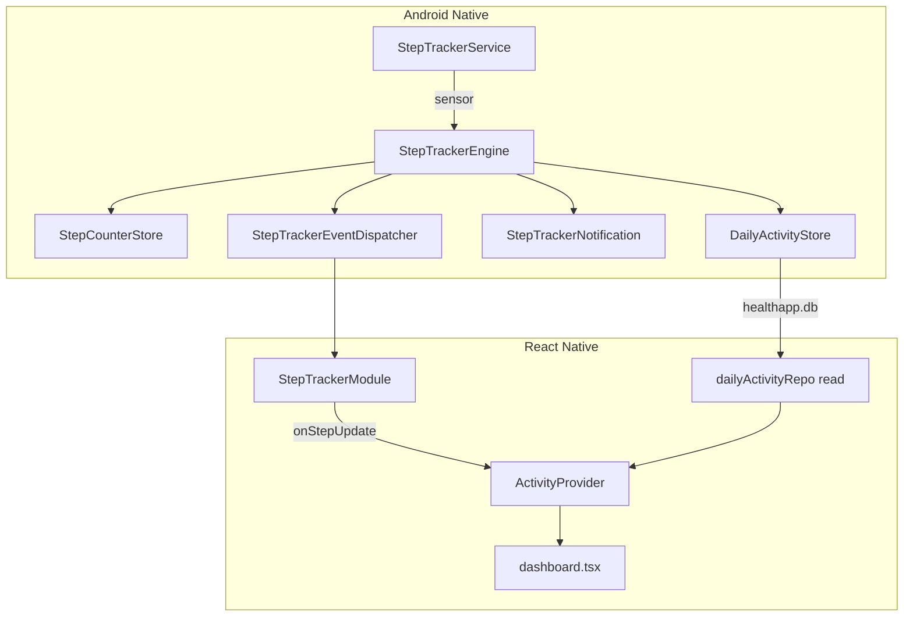

# Event-Driven Step Tracking + Native Persistence Plan

## Current problems (what we are fixing)

- [dashboard.tsx](client/src/app/(tabs)/dashboard.tsx) polls `getTodaySteps()` every **2.5s** and saves to SQLite every **15s** — wastes battery and only works while dashboard is mounted.
- Two sensor listeners exist: [StepTrackerModule.kt](client/modules/step-tracker/android/src/main/java/expo/modules/steptracker/StepTrackerModule.kt) (in-process) and [StepTrackerService.kt](client/modules/step-tracker/android/src/main/java/expo/modules/steptracker/StepTrackerService.kt) (foreground).
- [StepCounterStore.kt](client/modules/step-tracker/android/src/main/java/expo/modules/steptracker/StepCounterStore.kt) resets at midnight but **never snapshots yesterday** to SQLite.
- `expo-sqlite` ([client.ts](client/src/db/client.ts)) is JS-only — cannot persist when the app UI never opens.

## Target data flow



---

## Phase 1 — Native persistence + rollover (foundation)

### 1A. New file: `DailyActivityStore.kt`

**Path:** [client/modules/step-tracker/android/src/main/java/expo/modules/steptracker/DailyActivityStore.kt](client/modules/step-tracker/android/src/main/java/expo/modules/steptracker/DailyActivityStore.kt)

Writes to the **same** DB file as JS: `healthapp.db` (matches [client.ts](client/src/db/client.ts)).

```kotlin
object DailyActivityStore {
  private const val DB_NAME = "healthapp.db"

  fun upsert(
    context: Context,
    date: String,
    steps: Int,
    calories: Int,
    stepGoal: Int,
    calorieGoal: Int
  ) {
    val db = context.openOrCreateDatabase(DB_NAME, Context.MODE_PRIVATE, null)
    try {
      db.execSQL("PRAGMA journal_mode=WAL;")
      db.execSQL(
        """
        INSERT INTO daily_activity (date, steps, calories, step_goal, calorie_goal)
        VALUES (?, ?, ?, ?, ?)
        ON CONFLICT(date) DO UPDATE SET
          steps = excluded.steps,
          calories = excluded.calories,
          step_goal = excluded.step_goal,
          calorie_goal = excluded.calorie_goal;
        """.trimIndent(),
        arrayOf(date, steps, calories, stepGoal, calorieGoal)
      )
    } finally {
      db.close()
    }
  }
}
```

**Note:** Table must exist before first native write. JS `runMigrations()` in [profileContext.tsx](client/src/context/profileContext.tsx) runs on app launch and creates it. If service starts before first app open (unlikely), native upsert will fail silently — log the error and retry on next sensor tick.

---

### 1B. Extend `StepCounterStore.kt` — goals in prefs + rollover snapshot

**Path:** [StepCounterStore.kt](client/modules/step-tracker/android/src/main/java/expo/modules/steptracker/StepCounterStore.kt)

Add prefs keys and a expanded profile sync:

```kotlin
private const val KEY_STEP_GOAL = "profile_step_goal"
private const val KEY_CALORIE_GOAL = "profile_calorie_goal"

fun setActivityProfile(
  context: Context,
  heightCm: Double,
  weightKg: Double,
  stepGoal: Int,
  calorieGoal: Int
) {
  prefs(context).edit()
    .putFloat(KEY_HEIGHT_CM, heightCm.toFloat())
    .putFloat(KEY_WEIGHT_KG, weightKg.toFloat())
    .putInt(KEY_STEP_GOAL, stepGoal)
    .putInt(KEY_CALORIE_GOAL, calorieGoal)
    .apply()
}

private fun goals(context: Context): Pair<Int, Int> {
  val p = prefs(context)
  return p.getInt(KEY_STEP_GOAL, 0) to p.getInt(KEY_CALORIE_GOAL, 0)
}
```

**Replace** the midnight branch in `updateFromRaw` (lines 53–59) with rollover save **before** reset:

```kotlin
if (storedDate != null && storedDate != today) {
  val finalSteps = p.getInt(KEY_BASELINE_TODAY_STEPS, 0)
  val finalCalories = activeCalories(context, finalSteps)
  val (stepGoal, calorieGoal) = goals(context)
  DailyActivityStore.upsert(
    context, storedDate, finalSteps, finalCalories, stepGoal, calorieGoal
  )
}

if (storedDate != today) {
  p.edit()
    .putString(KEY_BASELINE_DATE, today)
    .putInt(KEY_BASELINE_RAW, rawSteps)
    .putInt(KEY_BASELINE_TODAY_STEPS, 0)
    .apply()
  return 0
}
```

---

### 1C. New file: `StepTrackerEngine.kt` — debounced side effects

**Path:** [client/modules/step-tracker/android/src/main/java/expo/modules/steptracker/StepTrackerEngine.kt](client/modules/step-tracker/android/src/main/java/expo/modules/steptracker/StepTrackerEngine.kt)

Central coordinator called from the service on every sensor update. Keeps battery cost low:

| Constant | Value | Purpose |
|----------|-------|---------|
| `NOTIFICATION_MIN_MS` | 60_000 | Max 1 notification rebuild/min |
| `DB_SAVE_MIN_MS` | 120_000 | Max 1 SQLite write/2 min |
| `DB_SAVE_STEP_DELTA` | 50 | Also save if steps increased by 50+ |

```kotlin
object StepTrackerEngine {
  private var lastNotifiedSteps = -1
  private var lastNotifiedAtMs = 0L
  private var lastSavedSteps = -1
  private var lastSavedAtMs = 0L

  fun onSensorRaw(context: Context, rawSteps: Int) {
    val todaySteps = StepCounterStore.updateFromRaw(context, rawSteps)
    if (todaySteps < 0) return

    val calories = StepCounterStore.activeCalories(context, todaySteps)
    val date = StepCounterStore.todayDateString()
    val now = System.currentTimeMillis()

    maybeUpdateNotification(context, todaySteps, calories, now)
    maybePersistToday(context, date, todaySteps, calories, now)
    StepTrackerEventDispatcher.dispatchStepUpdate(todaySteps, calories, date)
  }

  fun flush(context: Context) {
    val steps = StepCounterStore.getTodaySteps(context)
    val calories = StepCounterStore.activeCalories(context, steps)
    val date = StepCounterStore.todayDateString()
    val (stepGoal, calorieGoal) = StepCounterStore.goals(context) // expose goals()
    DailyActivityStore.upsert(context, date, steps, calories, stepGoal, calorieGoal)
    lastSavedSteps = steps
    lastSavedAtMs = System.currentTimeMillis()
  }

  private fun maybePersistToday(...) { /* check interval OR step delta, then upsert */ }
  private fun maybeUpdateNotification(...) { /* skip if same steps + within interval */ }
}
```

Call `StepTrackerEngine.flush(this)` from `StepTrackerService.onDestroy()`.

---

### 1D. Update `StepTrackerService.kt`

**Path:** [StepTrackerService.kt](client/modules/step-tracker/android/src/main/java/expo/modules/steptracker/StepTrackerService.kt)

Changes:
- `SENSOR_DELAY_UI` → `SENSOR_DELAY_NORMAL` (less CPU)
- Replace inline logic with `StepTrackerEngine.onSensorRaw`
- Add `onDestroy` flush

```kotlin
override fun onSensorChanged(event: SensorEvent?) {
  if (event?.sensor?.type != Sensor.TYPE_STEP_COUNTER) return
  StepTrackerEngine.onSensorRaw(this, event.values[0].toInt())
}

override fun onDestroy() {
  StepTrackerEngine.flush(this)
  sensorManager.unregisterListener(this)
  super.onDestroy()
}
```

Initial `onStartCommand` can call `StepTrackerEngine.onSensorRaw` with last known raw or just read stored steps for notification bootstrap.

---

## Phase 2 — Native events bridge (replace polling)

### 2A. New file: `StepTrackerEventDispatcher.kt`

**Path:** [client/modules/step-tracker/android/src/main/java/expo/modules/steptracker/StepTrackerEventDispatcher.kt](client/modules/step-tracker/android/src/main/java/expo/modules/steptracker/StepTrackerEventDispatcher.kt)

Service cannot call `sendEvent` directly — use a singleton bridge:

```kotlin
object StepTrackerEventDispatcher {
  private var lastEmittedSteps = -1
  private var emitter: ((String, Map<String, Any>) -> Unit)? = null

  fun setEmitter(fn: (String, Map<String, Any>) -> Unit) {
    emitter = fn
  }

  fun clearEmitter() {
    emitter = null
  }

  fun dispatchStepUpdate(steps: Int, calories: Int, date: String) {
    if (steps == lastEmittedSteps) return
    lastEmittedSteps = steps
    emitter?.invoke(
      "onStepUpdate",
      mapOf("steps" to steps, "calories" to calories, "date" to date)
    )
  }
}
```

---

### 2B. Update `StepTrackerModule.kt` — events + remove duplicate sensor

**Path:** [StepTrackerModule.kt](client/modules/step-tracker/android/src/main/java/expo/modules/steptracker/StepTrackerModule.kt)

**Remove entirely:**
- `sensorListener`, `latestRawSteps`, `startTrackingIfPermitted`, `stopInProcessTracking`
- `OnCreate` auto-tracking
- `stopForegroundTracking` fallback to in-process listener

**Add:**

```kotlin
override fun definition() = ModuleDefinition {
  Name("StepTracker")
  Events("onStepUpdate")

  OnCreate {
    StepTrackerEventDispatcher.setEmitter { name, payload ->
      sendEvent(name, payload)
    }
  }

  OnDestroy {
    StepTrackerEventDispatcher.clearEmitter()
  }

  Function("setActivityProfile") { heightCm: Double, weightKg: Double, stepGoal: Int, calorieGoal: Int ->
    val context = applicationContext() ?: return@Function false
    StepCounterStore.setActivityProfile(context, heightCm, weightKg, stepGoal, calorieGoal)
    StepTrackerNotification.refresh(context)
    true
  }

  Function("getTodaySteps") {
    val context = applicationContext() ?: return@Function -1
    StepCounterStore.getTodaySteps(context)
  }
  // ... keep hasStepSensor, startForegroundTracking, stopForegroundTracking
}
```

Keep `setProfileMetrics` as a thin wrapper calling `setActivityProfile` with goals read from prefs (backward compat) OR replace all JS callers with `setActivityProfile`.

---

### 2C. Update JS module types + exports

**[StepTrackerModule.ts](client/modules/step-tracker/src/StepTrackerModule.ts):**

```typescript
import { NativeModule, requireNativeModule } from 'expo';

export type StepUpdateEvent = {
  steps: number;
  calories: number;
  date: string; // YYYY-MM-DD
};

type StepTrackerModuleType = NativeModule<{
  onStepUpdate: (event: StepUpdateEvent) => void;
}> & {
  getTodaySteps(): number;
  setActivityProfile(heightCm: number, weightKg: number, stepGoal: number, calorieGoal: number): boolean;
  startForegroundTracking(): boolean;
  // ...existing
};

export default requireNativeModule<StepTrackerModuleType>('StepTracker');
```

**[index.ts](client/modules/step-tracker/src/index.ts)** — add listener helper, consolidate init:

```typescript
import { EventSubscription } from 'expo-modules-core';
import StepTrackerModule, { type StepUpdateEvent } from './StepTrackerModule';

export type { StepUpdateEvent };

export function addStepUpdateListener(
  listener: (event: StepUpdateEvent) => void
): EventSubscription {
  return StepTrackerModule.addListener('onStepUpdate', listener);
}

export function setActivityProfile(
  heightCm: number, weightKg: number, stepGoal: number, calorieGoal: number
): boolean {
  return StepTrackerModule.setActivityProfile(heightCm, weightKg, stepGoal, calorieGoal);
}

/** Single entry: permissions + foreground service. Call once from ActivityProvider. */
export async function initStepTracking(): Promise<boolean> {
  if (Platform.OS !== 'android') return true;
  const granted = await requestStepPermission(); // keep existing permission flow
  if (!granted) return false;
  return startForegroundTracking();
}
```

Update `requestStepPermission` to call `startForegroundTracking()` instead of `startTracking()` (remove dead in-process path).

---

## Phase 3 — `ActivityProvider` (root context)

### 3A. New file: `activityContext.tsx`

**Path:** [client/src/context/activityContext.tsx](client/src/context/activityContext.tsx)

Responsibilities:
- Call `initStepTracking()` once when `profile` is loaded
- Sync `setActivityProfile(...)` whenever profile changes
- Subscribe to `onStepUpdate` for live `steps` / `calories`
- Load `weekData` from SQLite on mount + on foreground + optionally on each event (debounced 5s for chart refresh)
- Expose `permissionDenied`, `sensorMissing` (one-time `getTodayStepsRaw()` + `hasStepSensor()` on init)

```typescript
type ActivityContextValue = {
  steps: number | null;
  calories: number | null;
  weekData: DailyActivity[];
  permissionDenied: boolean;
  sensorMissing: boolean;
  refreshWeekFromDb: () => Promise<void>;
};

export function ActivityProvider({ children }: { children: React.ReactNode }) {
  const { profile } = useProfile();
  const [steps, setSteps] = useState<number | null>(null);
  const [weekData, setWeekData] = useState<DailyActivity[]>([]);
  // ...

  const syncProfileToNative = useCallback(() => {
    if (!profile || Platform.OS !== 'android') return;
    setActivityProfile(
      profile.heightCm, profile.weightKg,
      profile.stepGoal, profile.calorieGoal
    );
  }, [profile]);

  useEffect(() => {
    if (!profile) return;
    let sub: EventSubscription;

    (async () => {
      syncProfileToNative();
      const ok = await initStepTracking();
      setPermissionDenied(!ok);
      setSteps(getTodaySteps());
      await refreshWeekFromDb();

      sub = addStepUpdateListener(({ steps: s, calories: c }) => {
        setSteps(s);
        // calories from event OR derive via activeCalories(s, profile)
      });
    })();

    const appSub = AppState.addEventListener('change', (state) => {
      if (state === 'active') {
        setSteps(getTodaySteps());
        refreshWeekFromDb();
        syncProfileToNative();
      }
    });

    return () => { sub?.remove(); appSub.remove(); };
  }, [profile, syncProfileToNative]);

  const calories = profile && steps !== null
    ? activeCalories(steps, profile)
    : null;

  // ...
}
```

**Calories source decision:** Prefer JS `activeCalories(steps, profile)` in context for single formula; native event `calories` is optional sanity check for notification only.

---

### 3B. Wire provider in root layout

**Path:** [_layout.tsx](client/src/app/_layout.tsx)

```typescript
import { ActivityProvider } from '@/context/activityContext';

export default function RootLayout() {
  return (
    <SafeAreaProvider>
      <ProfileProvider>
        <ActivityProvider>
          <RootNavigation />
        </ActivityProvider>
      </ProfileProvider>
    </SafeAreaProvider>
  );
}
```

`ActivityProvider` must be **inside** `ProfileProvider` (needs profile).

---

## Phase 4 — Slim down dashboard

**Path:** [dashboard.tsx](client/src/app/(tabs)/dashboard.tsx)

### Remove
- `STEP_POLL_MS`, `steps` local state, `refreshSteps`, `saveTodayToDisk`
- Both `setInterval` blocks (2.5s poll + 15s save)
- Imports: `getTodaySteps`, `getTodayStepsRaw`, `requestStepPermission`, `startForegroundTracking`, `setProfileMetrics`, `upsertDailyActivity`
- Profile-sync and tracking `useEffect` blocks

### Replace with
```typescript
const {
  steps, calories, weekData, permissionDenied, sensorMissing,
} = useActivity();
```

Keep `weekChartData` merge logic (today = live from context, past days = `weekData` from DB) — unchanged pattern at lines 181–199.

---

## Phase 5 — Cleanup + docs

| File | Action |
|------|--------|
| [dailyActivityRepo.ts](client/src/db/dailyActivityRepo.ts) | Update comment: native owns writes; JS reads only. Keep `upsertDailyActivity` for tests/manual use. |
| [StepTrackerModule.web.ts](client/modules/step-tracker/src/StepTrackerModule.web.ts) | Stub `addStepUpdateListener` no-op, `initStepTracking` returns false |
| [profileContext.tsx](client/src/context/profileContext.tsx) | No changes required (migrations still run here) |

---

## Battery / performance checklist

- One sensor listener (service only) — no module listener
- `SENSOR_DELAY_NORMAL` in service
- No JS timers for steps or saves
- Native SQLite writes debounced (2 min / 50-step delta)
- Notification updates debounced (60s)
- JS events only when step count changes
- On app foreground: one `getTodaySteps()` + one DB read (not continuous)

---

## Verification test plan

1. **Fresh install:** Complete onboarding → grant permissions → notification shows steps without opening dashboard tab.
2. **Live UI:** Walk with dashboard open → steps/calories/telemetry ring update without 2.5s lag (should update on sensor batch, not poll).
3. **Background persist:** Walk 10+ min, never open dashboard, kill app, reopen → weekly chart shows today's steps from SQLite.
4. **Midnight rollover:** Simulate date change (or wait until midnight) → yesterday's bar in chart has final count; today resets to 0 in notification and UI.
5. **Profile change:** Update height/weight/goals → notification calories and native DB goal snapshots update.
6. **Rebuild required:** Native Kotlin changes need `npx expo run:android` (not just Metro refresh).

---

## File change summary

| Action | File |
|--------|------|
| **Create** | `DailyActivityStore.kt` |
| **Create** | `StepTrackerEngine.kt` |
| **Create** | `StepTrackerEventDispatcher.kt` |
| **Create** | `activityContext.tsx` |
| **Modify** | `StepCounterStore.kt` |
| **Modify** | `StepTrackerService.kt` |
| **Modify** | `StepTrackerModule.kt` |
| **Modify** | `StepTrackerModule.ts` |
| **Modify** | `index.ts` (step-tracker) |
| **Modify** | `_layout.tsx` |
| **Modify** | `dashboard.tsx` |
| **Modify** | `StepTrackerModule.web.ts` (stubs) |
| **Modify** | `dailyActivityRepo.ts` (comment only) |
